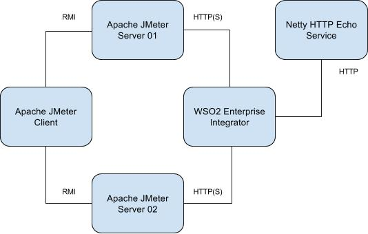

# Artifacts for WSO2 Enterprise Integrator Performance Tests

---
|  Branch | Build Status |
| :------ |:------------ |
| master  | [](https://wso2.org/jenkins/job/platform-builds/job/performance-ei/) |
---

This repository has artifacts to be used for WSO2 Enterprise Integrator Performance Tests.

The [distribution](distribution) directory has the scripts and the Maven project to build the final distribution package
 to be used for performance tests.

The package (**performance-ei-distribution-${version}.tar.gz**) built by the distribution maven module is the
 package required for Enterprise Integrator performance tests from this repository.

The (**performance-common-distribution-${version}.tar.gz**) package is also required for performance tests.

The scripts in this repository depend on the scripts in
 "[performance-common](https://github.com/wso2/performance-common/)" repository.

**Note:** The scripts are only compatible with **WSO2 Enterprise Integrator 6.x.x**.

Following is the recommended deployment for performance testing.



## Package contents

Following is the tree view of the contents inside distribution package.

```
|-- ei
|   |-- capp
|   |   `-- ESBPerformanceTestArtifacts_1.0.0.car
|   |-- ei-start.sh
|   `-- setup.sh
`-- jmeter
    |-- ei-test.jmx
    |-- requests
    |   |-- 100K_buyStocks_secure.xml
    |   |-- 100K_buyStocks.xml
    |   |-- 10K_buyStocks_secure.xml
    |   |-- 10K_buyStocks.xml
    |   |-- 1K_buyStocks_secure.xml
    |   |-- 1K_buyStocks.xml
    |   |-- 200K_buyStocks.xml
    |   |-- 500B_buyStocks_secure.xml
    |   |-- 500B_buyStocks.xml
    |   |-- 500K_buyStocks_secure.xml
    |   |-- 500K_buyStocks.xml
    |   |-- 5K_buyStocks_secure.xml
    |   `-- 5K_buyStocks.xml
    `-- run-performance-test.sh
```

Each directory has executable scripts.

This package must be extracted in user home directory of all JMeter nodes and the Enterprise Integrator node used for the
 performance tests.

In addition, please make sure to extract the "performance-common" package to all nodes and install Java, JMeter, and SAR
 to all nodes by using scripts provided.

**Note:** These scripts will work only on Debian based systems like Ubuntu.

See following sections for more details.

### WSO2 Enterprise Integrator

The "ei" directory has the scripts related to WSO2 Enterprise Integrator and the configurations. These scripts must be run in
 WSO2 Enterprise Integrator node.

Following sections have more details about each script.

#### setup.sh

The `setup.sh` script extracts WSO2 Enterprise Integrator to user home directory and copies the CAPP containing the services.

How to run:

`./setup.sh netty_host`

#### ei-start.sh

This script starts the WSO2 Enterprise Integrator with the given Java heap size and enable Garbage Collection (GC) logs in the
 server.

How to run:

`./ei-start.sh wso2ei-6.1.1 4`

Above example will start the Enterprise Integrator version 6.1.1 with 4GB of heap.

**Note:** This script is called from `setup.sh` and the performance test script.

### Apache JMeter

Inside "jmeter", directory there are scripts to run the performance tests and create a summary CSV from the JMeter
 results.

#### run-performance-test.sh

The `run-performance-test.sh` script runs the performance tests for different test scenarios. This script must be used
 in the JMeter client node and it uses the two JMeter servers to load test WSO2 Enterprise Integrator

This script is using ssh config to connect with other nodes from JMeter client and get server metrics and log files.
 Therefore, it is important use a configuration as follows in `~/.ssh/config`

```
Host jmeter1
    HostName x.x.x.1
    User ubuntu
    IdentityFile ~/keys/ei.pem

Host jmeter2
    HostName x.x.x.2
    User ubuntu
    IdentityFile ~/keys/ei.pem

Host ei
    HostName x.x.x.3
    User ubuntu
    IdentityFile ~/keys/ei.pem

Host netty
    HostName x.x.x.4
    User ubuntu
    IdentityFile ~/keys/ei.pem
```

There are multiple parameters inside the script and the values should be changed as required.

 Parameter | Description
------------ | -------------
concurrent_users | The different number of concurrent users. This an array and the brackets are important.
backend_sleep_time | The different backend sleep times in milliseconds. This is an array.
proxy_types | Different proxy types used for tests. Default `proxy_types=(DirectProxy CBRProxy CBRSOAPHeaderProxy CBRTransportHeaderProxy SecureProxy XSLTEnhancedProxy XSLTProxy`)
request_payloads | Payloads used for proxy types excepts for SecureProxy
secure_payloads | Payloads used for SecureProxy
ei_host | The Enterprise Integrator IP
ei_ssh_host | The ssh host for the API Manager node
backend_ssh_host | The ssh host for the node with Netty HTTP Echo Service
netty_port | The port of Netty HTTP Echo Service. Default: 9000
test_duration | Duration of the test in seconds.
warmup_time | The warmup time in minutes. This is used for JTL Splitter, which is from `performance-common`
jmeter1_host | The hostname or IP of the JMeter Server 01
jmeter2_host | The hostname or IP of the JMeter Server 02
jmeter1_ssh_host | The ssh host for the JMeter Server 01
jmeter2_ssh_host | The ssh host for the JMeter Server 02
heap_size | Heap Size in GBs

After changing parameters, the performance tests can be started from the script in the JMeter Client node as shown in
 above diagram. It's recommended to run the tests in `nohup` mode.

For example:

`nohup ./run-performance-test.sh > test.out 2>&1 &`

The results of performance tests will be saved in `results` directory.

#### create-summary-csv.sh

After the performance tests are completed, a summary CSV for all results can be created using this script file.

The script expects the [GCViewer](https://github.com/chewiebug/GCViewer) jar file to analyze GC logs. The latest
 GCViewer JAR file can be downloaded from [Maven](http://repo1.maven.org/maven2/com/github/chewiebug/gcviewer/)

The script must be run inside the results directory.

How to run:

`~/jmeter/create-summary-csv.sh /path/to/gcviewer*.jar`

## Steps to run performance tests

Following are the high-level steps to run the performance tests.

* Copy the `performance-ei` and `performance-common` packages to all servers.
* Extract the packages in user home directory
* Download latest Oracle JDK 8 to all servers.
* Download latest Apache JMeter to all JMeter servers.
* Download WSO2 Enterprise Integrator product to EI server.
* Install Java in all servers using the `install-java.sh` script inside `java` directory.
* Install 'System Activity Report' in all servers using the `install-sar.sh` script inside `sar` directory.
* Install 'Apache JMeter' in all JMeter servers using the `install-jmeter.sh` script inside `jmeter` directory
* Setup WSO2 Enterprise Integrator in EI server using `setup.sh` script.
* Run the performance test using `run-performance-test.sh` script.
* Use `create-summary-csv.sh` to generate a summary.csv file from the test results.

## License

Copyright 2018 WSO2 Inc. (http://wso2.com)

Licensed under the Apache License, Version 2.0
